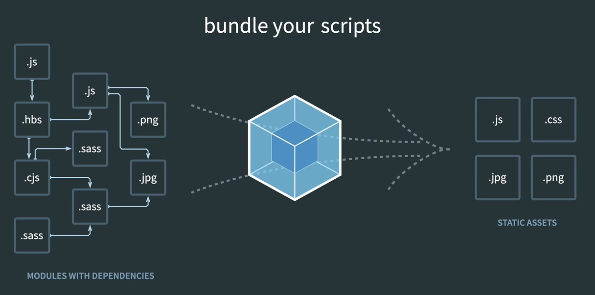

# module

- 파일 간 변수 이름 충돌을 막기위한 namespace
- 모듈의 범위는 파일 단위로 제한.
  - 파일 내부에서 선언한 변수나 함수는 기본적으로 해당 파일 안에서만 접근 가능함.
  - 외부에서 접근하려면 export 키워드로 명시적으로 내보내야 함.

# webpack

- 여러 js 파일을 하나로 묶어주는 번들러
- 역할
  - 오래된 브라우저도 지원하는 코드로 자동 변환
  - 여러 JS 파일을 하나로 묶음
- 기본 명령어
  - `npx webpack --entry [엔트리파일] --output-path [번들링된 파일이 저장될 위치]`

# webpack.config.js

- 번들링할 때 항상 cli 명령어를 터미널에 치는 건 너무 번거로움
- 설정파일을 만들면 간단하게 실행할 수 있음.
- `webpack.config.js`에 웹팩 관련 설정을 작성하고, npm webpack --config webpack.config.js로 실행하면 위에서 실행한 명령어와 동일한 역할을 함
- 설정파일명이 webpack.config.js라면 --config 옵션은 생략 가능

# loader

- 웹팩은 JS 뿐만이 아니라, 다른 리소스도 번들링할 수 있다.
- https://webpack.js.org/guides/asset-management/#loading-css
  - ex: css, image, font,
